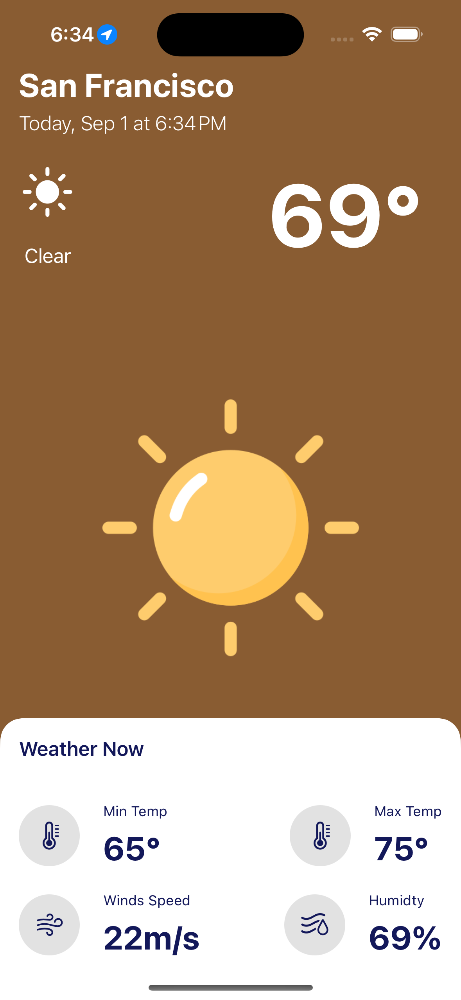

# WeatherApp 🌥️


**WeatherApp** is a SwiftUI-based application that provides current weather conditions for your location. This project is a part of my learning journey in mobile development using SwiftUI and Xcode 17.

## Features

- Displays current weather conditions including temperature, humidity, and wind speed.
- Dynamic background colors
and weather icons that adapt based on current weather conditions and the time of day
- Fetches weather data from an API.
- Custom weather icons based on the weather conditions.
- Simple and clean user interface designed using SwiftUI.

## Design
<!-- Container for Flexbox-like layout -->
<div style="display: flex; justify-content: space-around; align-items: center;">

  <!-- Link to the Imgur album -->
  <a href="https://imgur.com/a/mwOhp6P">
    <!-- Image from Imgur with adjusted width -->
    
  </a>

  <!-- Local image with the same size as the GIF -->
  

</div>

## Installation

1. Clone this repository:
    ```bash
    git clone https://github.com/yourusername/weatherapp.git
    ```
2. Open the project in Xcode:
    ```bash
    cd weatherapp
    open WeatherApp.xcodeproj
    ```
3. Run the app on a simulator or a connected device.

## Usage

- Launch the app.
- Allow location access to get weather updates for your current location.
- View the weather data on the main screen.

## Learning Experience

This app was developed as a learning experience, focusing on:

- **SwiftUI**: Building modern UIs declaratively.
- **Networking**: Fetching data from an API and handling JSON responses.
- **Xcode**: Using Xcode 17 for development and debugging.
- **Experience** I struggled with adding dynamic features and took some time to implement them in the app 

## License

This project is licensed under the MIT License. See the [LICENSE](LICENSE) file for more information.

## Acknowledgments

- [OpenWeatherMap API](https://openweathermap.org/api) for providing weather data.
- [SwiftUI](https://developer.apple.com/xcode/swiftui/) for making UI development easier and more intuitive.
- [Youtube](https://www.youtube.com/watch?v=X2W9MPjrIbk&t=1365s) for providing the crash course of this project 
